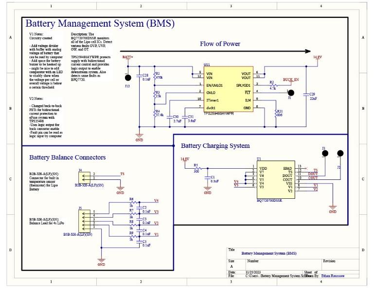
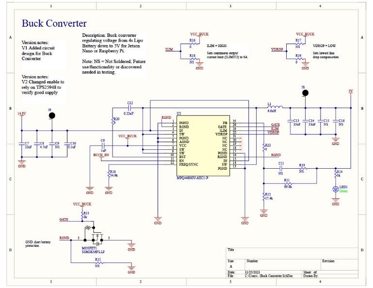

Power System Design
=========================

The power board took the most time to design
and layout as power signals are the most delicate to
deal with when ensuring that loss is not generated,
and that power is consistently output. The board is
split into two subsystems, the battery management
system (BMS) and the buck converter. The flow of
power begins with the BMS (Fig. 2) with the supply
of the 4S6P LiPo Battery provided by BlueRobotics.
This battery supplies 14.8V with a maximum 60A
current draw. To protect this battery and the rest of
the circuity, two chips are used for the charging anddischarging side. The discharging side uses a
TPS259480 3.5V to 23V, 8A eFuse chip to protect
the main 14.8V being used by other circuitry and the
thruster power. This chip replaced a previous back-
to-back MOSFET design that had errors in
implementation. With a lack of expertise in
MOSFETs from team members, this chip contains a
working bi-directional MOSFET protection. Other
faults like over and under voltage, short and open
circuits, and overtemperature are handled by the
eFuse. The charging side uses a BQ77207 Voltage
and Temperature Protection for 3-series to 7-series
Cell Li-Ion Batteries chip. This IC takes in the
protected main voltage and the battery balance inputs
that charge the battery and provide constant charging
of the battery cells to prevent over draining. The
same aforementioned electrical faults are also
monitored with this chip.

   With the protected input, the voltage is now
stepped down to 5V with the buck converter (Fig. 3)
circuit. This subsystem uses the MPQ4480 6A, 36V,
Step-Down Switch-Mode Converter chip. This IC
uses a switching frequency of 440kHz, voltage
divider, and feedback to step down the voltage.
Ceramic capacitors are connected to the input to
reduce ripple current and at the output to reduce
ripple voltage. The enable line for this chip is tied to
the BMS’s discharging chip to validate the
protection of the voltage and not enable any
component early. A ground short MOSFET is also
tied to the buck converter for added short protection.

Power Merge Board
--------------------

