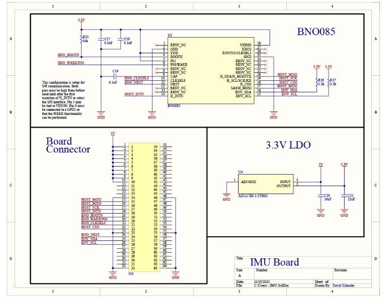

Sensor boards
=======================

Our main board has two locations for connecting your own sensors, which can communciate over I2C to the onboard computer.

The final PCB that was designed was the first
sensor board for an off the shelf IMU. This board was
made considerably smaller to allow for multiple
sensor modules to interface with the main board and
whichever computer is being used. A 3.3V step-
down converter takes the 5V from the power and
supplies the IMU. This IMU can use multiple
communication protocols including I2C and SPI
depending on the needs of the application.