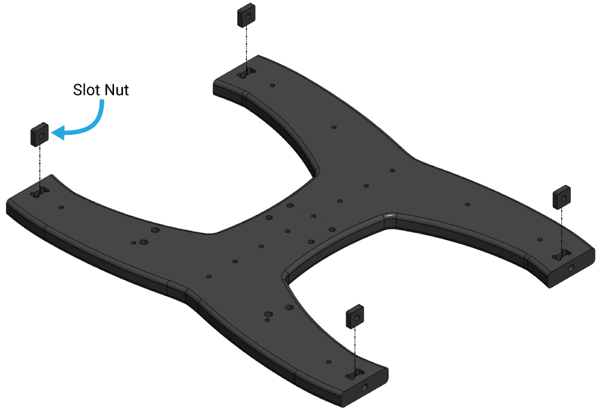

Setup
=====

Ubuntu Operating System
--------------------------------------
A Raspberry Pi or Jetson Nano with the ability to run docker will be required. Initially development will be completed on
a Raspberry Pi 4 with stock Ubuntu 22.04 installed on it. The Jetson Nano will be used for testing and development as well with docker.

Python Installation and Required Packages 
-----------------------------------------------------
For some of our packages you may require certain extra packages. This section will take you through all the required packages.

Please run the following commands first before doing anything else.

.. code-block:: bash

    sudo apt update && sudo apt upgrade

First ensure python3 and pip are installed. This can be done through the following commands:

Python & pip
^^^^^^^^^^^^

.. code-block:: bash

    sudo apt install python3

.. code-block:: bash

    sudo apt install python3-pip

NumPy
^^^^^
You will also need NumPy for various things. They have arrays, array operations, etc. and are useful for efficient computing.

.. code-block:: bash

    pip3 install numpy

``lgpio``
^^^^^^^^^^
``lgpio`` is required for using the GPIO headers on the Pi.

.. code-block:: bash
    
    pip3 install lgpio

You may need to give yourself permission to use the GPIO headers by adding yourself to the ``dialout`` group. This can be done by running the following command:

.. code-block:: bash
    
        sudo usermod -aG dialout $USER
    

ROS 2 Installation and Configuration from Debian Packages
---------------------------------------------------------
These installation instructions are a direct copy from `ROS 2 Humble's installation page <https://docs.ros.org/en/humble/Installation/Ubuntu-Install-Debians.html>`_

To install ROS 2 through debian packages is quite simple, if you wish to install through binary packages or build from source you can find those instructions on the ROS 2 Humble documentation website.

.. warning:: If you install ROS 2 Humble through building from source, we will provide no support or help for any issues you run into. The issues can be so varied and it is difficult to be informed on all of them.

Setup Sources
^^^^^^^^^^^^^
You will need to add the ROS 2 apt repositories to your system. First ensure that the Ubuntu Universe repository is enabled:

.. code-block:: bash

    sudo apt install software-properties-common
    sudo add-apt-repository universe

Install curl (if it is not already installed):

.. code-block:: bash

    sudo apt update && sudo apt install curl -y

Add the GPG key:
    
.. code-block:: bash

    sudo curl -sSL https://raw.githubusercontent.com/ros/rosdistro/master/ros.key -o /usr/share/keyrings/ros-archive-keyring.gpg

Add the repository to your sources list:

.. code-block:: bash

    echo "deb [arch=$(dpkg --print-architecture) signed-by=/usr/share/keyrings/ros-archive-keyring.gpg] http://packages.ros.org/ros2/ubuntu $(. /etc/os-release && echo $UBUNTU_CODENAME) main" | sudo tee /etc/apt/sources.list.d/ros2.list > /dev/null

Install ROS 2
^^^^^^^^^^^^^
Update your APT repository cache after setting up your repositories.

.. code-block:: bash

    sudo apt update

ROS 2 packages are built on frequently updated Ubuntu systems. It is always recommended that you ensure your system is up to date before installing new packages.

.. code-block:: bash

    sudo apt upgrade

Desktop Install: ROS, RViz, demos, tutorials.

.. code-block:: bash

    sudo apt install ros-humble-desktop

Install Colcon.

.. code-block:: bash

    sudo apt install python3-colcon-common-extensions

Configuring the terminal (Recommended)
^^^^^^^^^^^^^^^^^^^^^^^^^^^^^^^^^^^^^^
If you want ROS 2 to be sourced every time you open a terminal, run the following command:

.. code-block:: bash
    
    echo "source /opt/ros/humble/setup.bash" >> ~/.bashrc

Raspberry Pi
------------

The raspberry pi has been setup with Ubuntu 22.04 Jammy Jellyfish with the following login for use.

.. warning:: Please update this as necessary. **Losing the password can cause setbacks**

* **User**: aprilab
* **Password**: apr1lab

Jetson Nano
------------

The Jetson Nano has been setup with Ubuntu 20.04 Focal Fossa by Nvidia with the following login for use. 

.. warning:: Please update this as necessary. **Losing the password can cause setbacks**

* **User**: april
* **Password**: apr1lab

Assembly and Build Instructions
----------------------------------

Introduction
^^^^^^^^^^^^^^^^^^

The Modularis kit requires several facets of assembly, can be completed with basic hand tools, no soldering or potting is required.
We have included a few of the tools to make assembly and regular use as easy as possible.

Parts and Tools
^^^^^^^^^^^^^^^^

You will need:

Here is a link to a comprehensive google sheet specifing all the required materials, broken down by structural,
electrical components, etc: 

The additional items below will also be needed:

- 1 x Wire cutters or scissors (for cutting zip ties)
- 1 x Medium-strength (blue) threadlocker such as Loctite 242 or 243.
- 1 x Bottle of Isopropyl alcohol or isopropyl alcohol wipes
- 1 x Small (~2 mm) flat head screwdriver
- Masking tape and a marker (optional)

Assembling the Frame
^^^^^^^^^^^^^^^^^^^^^^^^^^^^^^^^^^

To prepare the frame panels you will need the following parts:

- Bottom panel and slot nuts
- Center panels and slot nuts

1. Insert the four slot nuts included with the bottom panel into the slot nut pockets.

2. Insert the slot nuts included with the center panels into each nut pocket in the front and rear center panels. 
The rear center panels are the two panels with three large holes at one end. Each panel receives two slot nuts.

 .. image:: files/brov2-r4-assem-centerp-slot-nuts.png
   :width: 500px
   :height: 500px
   :align: center

