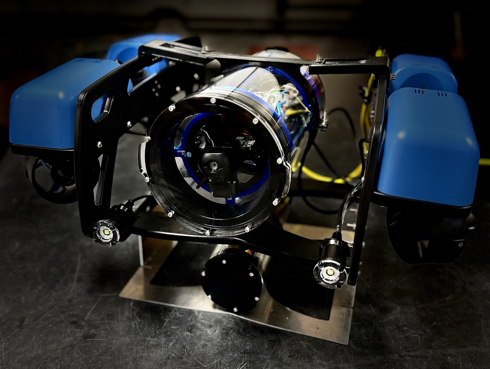

Modularis
=========

|

While autonomous robots have seen significant research advancements in recent years, due to the harsh nature 
of underwater environment, there is limited availability in finding off-the-shelf underwater robots for various 
applications. Custom-built underwater robots may be necessary for specialized applications or missions, but the 
process can be more costly, time-consuming, and requiring expert knowledge. This challenge makes validation and 
verification process difficult. To address these challenges, we propose a modular underwater robot that can serve 
as an open-source testbed system that is customizable and subject to environmental variability.

This project is under the `Active Perception and Robot Intelligence Lab <https://janeshin-website.github.io/>`_ at
the `University of Florida <https://ufl.edu>`_ in the `Department of Mechanical and Aerospace Engineering <https://mae.ufl.edu>`_.

.. toctree::
   :caption: Getting Started
   :maxdepth: 1
   :hidden:

   Setup <getting_started/setup>
   Software Tools <getting_started/tools>

.. toctree::
   :caption: Software
   :maxdepth: 2
   :hidden:

   ROS 2 Software <software/software>
   

.. toctree:: 
   :caption: Electrical Hardware
   :maxdepth: 1
   :hidden:

   Electrical Hardware <electrical/electrical>

.. toctree:: 
   :caption: Mechanical Hardware
   :maxdepth: 1
   :hidden:

   Mechanical Hardware <mechanical/mechanical>

.. toctree:: 
   :caption: Theoretical Information
   :maxdepth: 1
   :hidden:

   Theoretical Information <theoretical/theoretical>

   
   
   

 
