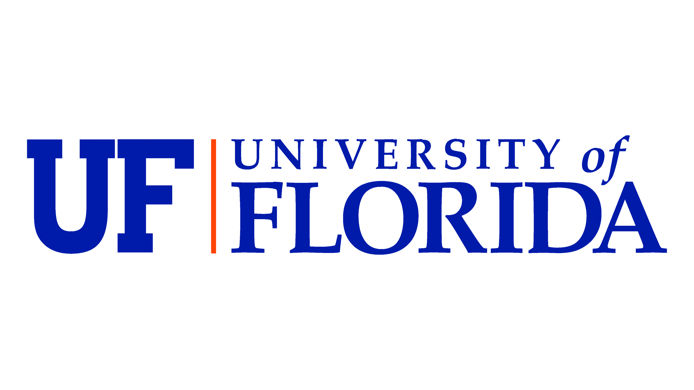

Modularis
=========

.. image:: modularis_home.jpg
   :width: 529px
   :height: 400px
   :align: center

|

Purpose
---------------------------

Modularis was designed for developers as a underwater sensing platform for validating 
autonomous mapping and planning algorithms.

We both felt and saw a lack in availability of affordable underwater robots which could easily be used for mapping and planning research.

Beyond this, our lab needed a vehicle that was multipurpose; capable of equiping a wide suite of sensors without having to make time-consuming
modifications. The idea for Modularis was born from this need. 

Advantages and Limitations
----------------------------

- Easily modifyable software for implementing custom controllers, perception algorithms, and planners
- Designed to work with multiple embedded systems, such as the Raspberry Pi, Jetson Nano, and TDA4VM-SDK
- Tethered and untethered missions
- Long battery life using two liPo batteries

Specifications
---------------------------------

- Operating depth of up to 100m
- 6 inch battery enclosure
- 2 x 3 inch battery enclosures on either side of the main tube
- 6 thrusters, 3 on each side, external to the main frame
- 1 bluerobotics payload bay, attached below the main tubes
- 2 x bluerobotics subsea lights
- Custom top bar stability connector with additional BlueRobotics fairing mounts
- Custom “spine” system designed to hold the 6 inch enclosure in place, depicted as the block underneath the 6 inch electronics enclosure
- 2 x side scan sonar mounts for Starfish SSS

Citation
----------------------------------

You can find the paper `here <https://arxiv.org/abs/2401.06243>`_.

If you find Modularis helpful to your research, please consider citing:

.. code-block:: latex

   @INPROCEEDINGS{herrin2023modularis,
   author={Herrin, Baker and Close, Victoria and Berner, Nathan and Hebert,
   Joshua and Reussow, Ethan and James, Ryan and Woodward, Cale and Mindlin,
   Jared and Paez, Sebastian and Bretas, Nilson and Shin, Jane},
   booktitle={OCEANS 2023 - MTS/IEEE U.S. Gulf Coast}, 
   title={Modularis: Modular Underwater Robot for Rapid Development 
   and Validation of Autonomous Systems}, 
   year={2023},
   pages={1-7},
   doi={10.23919/OCEANS52994.2023.10337059}}

.. While autonomous robots have seen significant research advancements in recent years, due to the harsh nature 
.. of underwater environment, there is limited availability in finding off-the-shelf underwater robots for various 
.. applications. Custom-built underwater robots may be necessary for specialized applications or missions, but the 
.. process can be more costly, time-consuming, and requiring expert knowledge. This challenge makes validation and 
.. verification process difficult. To address these challenges, we propose a modular underwater robot that can serve 
.. as an open-source testbed system that is customizable and subject to environmental variability.

This project is under the `Active Perception and Robot Intelligence Lab <https://janeshin-website.github.io/>`_ at
the `University of Florida <https://ufl.edu>`_ in the `Department of Mechanical and Aerospace Engineering <https://mae.ufl.edu>`_.

|

.. toctree::
   :caption: Getting Started
   :maxdepth: 1
   :hidden:

   System Info <getting_started/system>
   Setup <getting_started/setup>
   Software Tools <getting_started/tools>
   People <getting_started/people>

.. toctree::
   :caption: Software
   :maxdepth: 2
   :hidden:

   ROS 2 Software <software/software>

.. toctree:: 
   :caption: Electrical Hardware
   :maxdepth: 1
   :hidden:

   Electrical Hardware <electrical/electrical>

|
.. toctree:: 
   :caption: Mechanical Hardware
   :maxdepth: 1
   :hidden:

   Mechanical Hardware <mechanical/mechanical>

.. toctree:: 
   :caption: Theoretical Information
   :maxdepth: 1
   :hidden:

   Theoretical Information <theoretical/theoretical>

.. toctree:: 
   :caption: Future Work
   :maxdepth: 1
   :hidden:

   Future work <futureWork/futureWork>

.. toctree:: 
   :caption: Test Cases and Demos
   :maxdepth: 1
   :hidden:

   Test cases <testCases/testCases>

   
   
   

 
