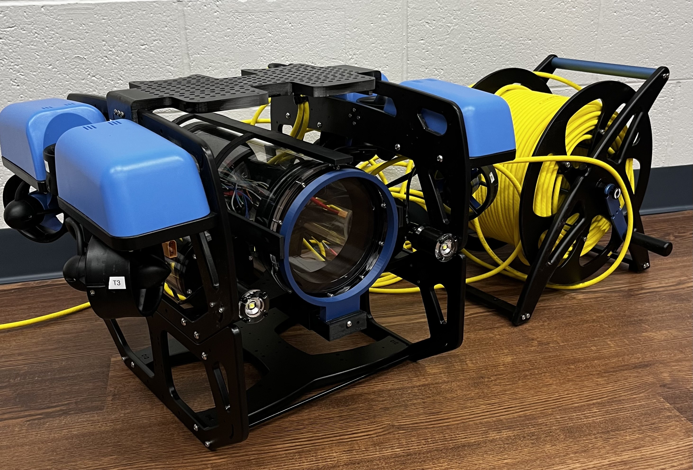

Modularis
=========

|

Purpose
---------------------------

Modularis was designed for developers, as a underwater sensing platform to launch from for validating 
autonomous mapping and planning algorithms.

We saw a lack in availability of affordable underwater vrobots which could easily be used for mapping and planning research.
Our lab needed a vehicle that was multipurpose; capable of equiping a wide suite of sensors without having to make time-consuming
modifications. The idea for Modularis was born from this need. 

Advantages and Limitations
----------------------------

- Easily modifyable software for implementing custom controllers, perception algorithms, and planners
- Designed to work with multiple embedded systems, such as the Raspberry Pi, Jetson Nano, and TDA4VM-SDK
- Tethered and untethered missions
- Long battery life using two liPo batteries

Specifications
---------------------------------

- Operating depth of up to 100m
- 6 inch battery enclosure
- 2 x 3 inch battery enclosures on either side of the main tube
- 6 thrusters, 3 on each side, external to the main frame
- 1 bluerobotics payload bay, attached below the main tubes
- 2 x bluerobotics subsea lights
- Custom top bar stability connector with additional BlueRobotics fairing mounts
- Custom “spine” system designed to hold the 6 inch enclosure in place, depicted as the block underneath the 6 inch electronics enclosure
- 2 x side scan sonar mounts for Starfish SSS

Electronics Enclosure
^^^^^^^^^^^^^^^^^^^^^^^

Modularis with the 6 inch enclosure can handle a load of at most:
- 6 thrusters
- 2 batteries
- 1 tether
- 1 set of BR lights (2 lights use 1 penetrator)
- 2 additional external sensors ( or one side-scan sonar)

FIXME: add image of penetrators face on, with each one's use labeled for 6-inch enclosure

Sensors Equipable
^^^^^^^^^^^^^^^^^^^^

- Starfish Side Scan Sonar (CAD for mounts provided)
- High definition camera with servo for changing orientation
- IMU #FIXME: IMU name

Designed to be Compatible With:
^^^^^^^^^^^^^^^^^^^^^^^^^^^^^^^^^^^^^
- Dell Ultrasharp webcam
- Waterlinked DVL
- Cerulean Insight-forward looking sonar
- Blueprint subsea multibeam sonar

System Cost
---------------------------

Cost is dependent on the peripherals you would like. Estimated cost here is based on the bill of materials. Use the following
link to determine your cost based on your required sensors etc.

https://docs.google.com/spreadsheets/d/13hn1dfgVYVuM1e82hrqp5kuuu4rw7KydsQJoyskKc7s/edit?usp=sharing

BlueRobotics Parts
^^^^^^^^^^^^^^^^^^^^^^

- T200 thrusters x 6     | 
- BR Skid                | $300
- BR Base Frame
- BR 

PCB's and PCB Components
^^^^^^^^^^^^^^^^^^^^^^^^^^

- LaTeX

3D Printed Parts
^^^^^^^^^^^^^^^^^^^^^^^

- Top bar connector
- Battery mounts x 4
- 

Computing Units
^^^^^^^^^^^^^^^^^^

- Pi vs Jetson

Computational and System Requirements
^^^^^^^^^^^^^^^^^^^^^^^^^^^^^^^^^^^^^^^^^^^

Sensors
^^^^^^^^^^^^^^^^

- camera

.. While autonomous robots have seen significant research advancements in recent years, due to the harsh nature 
.. of underwater environment, there is limited availability in finding off-the-shelf underwater robots for various 
.. applications. Custom-built underwater robots may be necessary for specialized applications or missions, but the 
.. process can be more costly, time-consuming, and requiring expert knowledge. This challenge makes validation and 
.. verification process difficult. To address these challenges, we propose a modular underwater robot that can serve 
.. as an open-source testbed system that is customizable and subject to environmental variability.

This project is under the `Active Perception and Robot Intelligence Lab <https://janeshin-website.github.io/>`_ at
the `University of Florida <https://ufl.edu>`_ in the `Department of Mechanical and Aerospace Engineering <https://mae.ufl.edu>`_.

.. toctree::
   :caption: Getting Started
   :maxdepth: 1
   :hidden:

   Setup <getting_started/setup>
   Software Tools <getting_started/tools>

.. toctree::
   :caption: Software
   :maxdepth: 2
   :hidden:

   ROS 2 Software <software/software>
   

.. toctree:: 
   :caption: Electrical Hardware
   :maxdepth: 1
   :hidden:

   Electrical Hardware <electrical/electrical>

.. toctree:: 
   :caption: Mechanical Hardware
   :maxdepth: 1
   :hidden:

   Mechanical Hardware <mechanical/mechanical>

.. toctree:: 
   :caption: Theoretical Information
   :maxdepth: 1
   :hidden:

   Theoretical Information <theoretical/theoretical>

   
   
   

 
