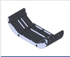

Bouyancy and Ballast
=====================

Modularis Top Plate
-------------------------

The top plate provides structural support and two mounting locations
for additional BlueRobotics fairings for bouyancy.

*ADD IMAGE HERE*

Ballast Control
--------------------

There are two options for adding ballast. For incremental changes,
BlueRobotics weights can screw on to the bottom plate of Modularis.

*IMAGE DEPICTING THIS*

Another option is mounting of dive weights discretly to Modularis as depicted below
for larger, fast adjustment of weight.

*IMAGE DEPICTING DIVE WEIGHT BALLASTING*

This structure does something

.. math::

    R = \dfrac{L}{\tan{\delta}} \tag{1}
