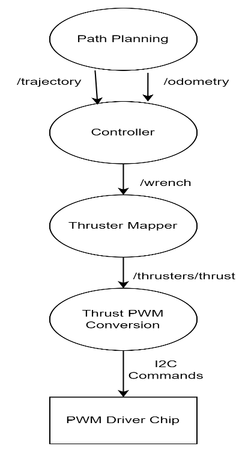

ROS 2 Software
===============

This area houses all the software documentation for the ROS 2 project. This includes documentation for the core 
ROS 2 packages, as well as documentation for the various client libraries. Modularis Thruster Mapper

The operating system used for the chosen
single board computer, raspberry pi 4, is Ubuntu
22.04 which provides support for ROS2 Humble.
The AUV is intended for use tethered and untethered.
When tethered, it will be connected to a more
powerful land-based processor for advanced
processing capabilities such as human recognition
and object detection. When untethered, all the
processing and data capture will be done on the
onboard computer.

The amount of thrust for each thruster
dictates the direction and speed of movement for the
AUV. To determine the desired thrusts for certain
movements, we used a thruster mapper. 

The thruster mapper is overall composed of 4 nodes in ROS2:
path planner, controller, thruster mapper, and PWM
conversion. 

The path planning node publishes the
/trajectory and /odometry topics that the controller
node subscribes to. The path planning node
determines the trajectory based on the desired
direction given to it (such as submerge, moving
forward, left, right).

 The /trajectory topic specifies
the desired position and orientation while the /odometry topic specifies the current location of the
AUV. The /odometry topic should ideally be based
on data gathered from sensors to accurately
determine position, but currently the /odometry is
determined based on a custom implementation that
estimates the AUVs location based on the given
trajectory. 

The controller node uses this data to
determine /wrench using a PID controller. 

The thruster mapper node subscribes to /wrench and uses
it to determine the amount of necessary effort for
each thruster. The PWM driver node takes this
information and uses it to send the appropriate
commands for I2C communication.

===================

Software dependencies:
----------------------

* Must have smbus python package installed
* Must have ROS2 Humble installed
* Must have threading and typing python packages installed 
* Must have time python package installed 

Hardware dependencies:
-----------------------

* Needs to be running on raspberry pi
* ``GPIO 2`` (SDA) and ``GPIO 3`` (SCL) must be connected to an I2C device (preferably the PWM driver on the modularis main board) before running or else the pwm_control_node will return an error

Details on the nodes in this package:
-----------------------------------

.. test_traj::

* test_traj simply uses the move_forward, submerge, and surface functions defined in ``basic_movement.py`` to publish trajectory and odometry topics for testing purposes 
* Trajectory and odometry topics published in a loop with a 10 second buffer between each call to the three movement functions

.. controller::

* controller subscribes to trajectory and odometry topics and uses this information to calculate and publish the wrench
* This controller is adapted from the controller used in mil thruster mapper

.. thruster_mapper::

* thruster_mapper subscribes to the wrench topic and uses thruster_map function to determine the effort to give to each thruster based on the defined thruster layout
* Calculates and publishes duty_cycle topic based on the calculated effort from thruster_map function 
* Publishes corresponding thrust_num topic for each duty_cycle published 

.. pwm_control_node::

* Subscribes to thrust_num and duty_cycle topic 
* Sends appropriate I2C signals from raspberry pi to communicate with PWM driver chip
* duty_cycle is float number to determine the positive pulse of the signal. Pulse of 0.21 (or 21%) corresponds to 1100us pulse, which creates max speed for reverse thrust direction. Pulse of 0.293 (or 29.3%) corresponds to 1500us pulse, which initializes thrusters and also stops them. Pulse of 0.37 (or 37%) corresponds to 1900us pulse, which creates max forward speed for thrusters

How to run the necessary four nodes:
-----------------------------------

* There are four nodes: ``test_traj``,``controller``,``thruster_mapper``, and ``pwm_control_node``. Duty_cycle simply takes in a duty cycle keyboard input ranging from 0.0 to 1.0. ``pwm_control_node`` subscribes to the duty_cycle topic to then send that command to the PWM driver chip to determine the pulse output from the PWM driver. For example, a duty cycle of 0.6 will correspond to an output square wave with a 60% positive width. 
* The launch file launches the three nodes: ``test_traj``,``controller``, and ``thruster_mapper``. For now, ``pwm_control_node`` is not included in the launch file for testing purposes so it will have to be run seperately. Eventually ``pwm_control_node`` should be added to launch file.   

Steps:
------

* Open terminal
* Ensure device you are ssh-ing from is connected to eduroam wifi (or whichever wifi raspberry pi is currently connected to, it should be default eduroam currently)
* Type ``ssh aprilab@[pi's ip address]`` into terminal. It should then prompt you for the password, which should be “apr1lab” (apr(ONE)lab) 
* cd ros2_ws then type :code:`source install/setup.bash` and :code:`source /opt/ros/humble/setup.bash`
* Type “ros2 launch modularis_thruster_mapper thruster_mapper.launch” in the terminal. Running this launch file will run the three nodes mentioned in the previous section
* In order to view the published duty cycles for testing purposes, can open new terminal and run :code:`ros2 topic echo /duty_cycle`
* In new terminal, type :code:`ros2 run modularis_thruster_mapper pwm_control_node` to start the ``pwm_control_node`` node. Ensure GPIO 2 and GPIO 3 from pi are appropriately connected to PWM driver chip, else running the node will return error
* Press ``ctrl + c`` in both terminals to stop the nodes

.. warning:: If running the pwm_control_node, run pwm_control_node before running launch file and ensure that five beeps from ESCs are heard first to ensure proper initialization before new duty cycles start getting published 

How to connect thrusters to main board and raspberry pi:
-----------------------------------------------------------

* Raspberry pi should connect to header pins on main board using ribbon connector
* ESC signal and ground (white and black wires) should connect to thruster pins on the main board

.. note:: Currently the pwm_control_node is configured to only have the PWM driver chip send PWM signals for thruster 0 and thruster 1 but that can be changed in the code by changing line 22 and 27 in pwmdriver/pwmdriver/pwm_control_node.py

.. toctree::
   :caption: Software Tree
   :maxdepth: 1

   Docker <docker/docker>
   Controls <control/control>
   Drivers <drivers/drivers>
   Interfaces <interfaces/interfaces>
   Planning <planning/planning>
   Side Scan Sonar <sonar/sonar>